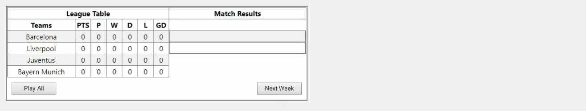

# react-champions-league-simulator
React component to simulate the Champions League.

You can see the component in the link here: http://react-champions-league-simulator.surge.sh/




### Props
- **teams** -> You can specify the teams and their powers by setting this prop.

### Usage 

```
import React, { Component } from 'react';
import League from './League';

class Example extends Component {
  constructor(props) {
    super(props);
    this.teams = {
      "Barcelona" : 1.8,
      "Liverpool" : 1.2,
      "Juventus" : 1.3,
      "Bayern Munich" : 1.6,
    }
  }


  render() {
    return (
      <League teams={this.teams}/>
    );
  }
}

export default Example;

```
